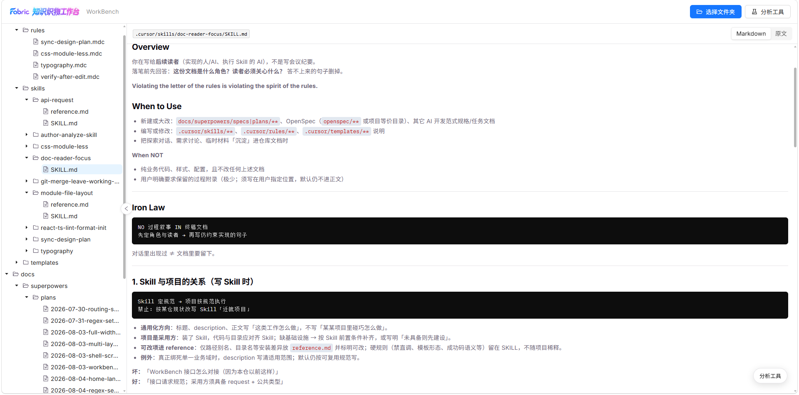
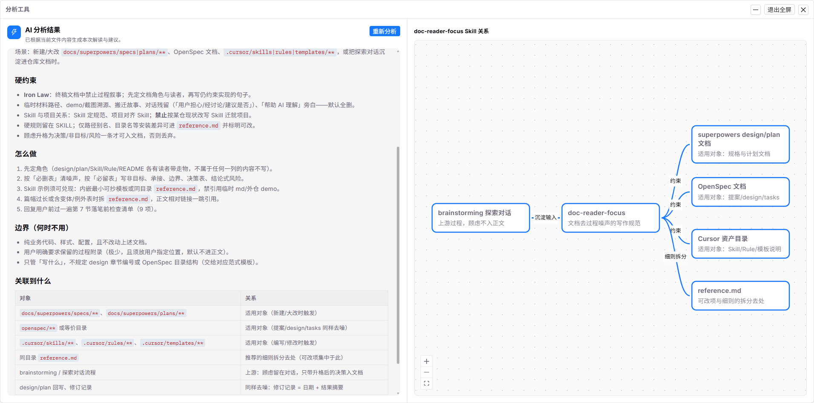

<p align="center">
  
</p>

<h1 align="center">Fabric 工作台</h1>

<p align="center">
  本地文档预览 · AI 流式分析 · 关系图谱
</p>

<p align="center">
  
  
  
  
</p>

Fabric（知识织物工作台）是一个面向本地项目文档的前端工作台：选择项目根目录后，按白名单扫描 Markdown / MDC，预览原文，并对选中文件发起 AI 分析，以流式 Markdown 与关系图谱呈现结果。

## 它能做什么

- **选择文件夹**：基于 File System Access API 选择项目根，浏览器内读取文件（无需上传整仓）
- **白名单扫描**：按规则匹配目录名与文件名，左侧目录树展示命中文件
- **Markdown 预览**：选中文件后右侧渲染预览（含 frontmatter 剥离展示）
- **一键分析**：将当前文件提交后端，SSE 流式累加分析结果
- **关系图谱**：分析结束后在浮窗中展示节点关系（React Flow）
- **正则设置**：维护扫描白名单规则（对接后端 CRUD）

### 截图

<p align="center">
  
</p>

<p align="center">
  
</p>

## 技术栈

| 类别 | 选型 |
| --- | --- |
| 框架 | React 19、TypeScript、Vite 8 |
| UI | Ant Design 6、Less（CSS Modules） |
| 路由 | React Router 7 |
| 请求 | axios + ahooks；SSE 使用 `@microsoft/fetch-event-source` |
| 图谱 | `@xyflow/react` + dagre |
| 文档渲染 | `react-markdown`、remark-gfm、rehype-highlight |

## 快速开始

### 环境要求

- Node.js 20+（建议 LTS）
- 包管理器：yarn / npm / pnpm 任一即可
- 浏览器：Chromium 系（Chrome / Edge 等），以便使用「选择文件夹」能力

### 安装与启动

```bash
# 克隆
git clone https://github.com/ADerCxx/WorkBenchUi.git
cd WorkBenchUi

# 安装依赖
yarn

# 配置环境变量
cp .env.example .env
# 按需修改 VITE_API_URL

# 开发服务器
yarn dev
```

浏览器打开终端提示的本地地址（默认 `http://localhost:5173`）。

> **提示**：仅浏览首页与静态 UI 可不依赖后端；扫描白名单、AI 分析、正则设置等需可用的 API 服务，并将 `VITE_API_URL` 指向其地址。

### 环境变量

| 变量 | 说明 | 示例 |
| --- | --- | --- |
| `VITE_API_URL` | 后端 API 基础地址 | `http://localhost:8080` |

参考模板见 [`.env.example`](.env.example)。

## 常用脚本

| 命令 | 说明 |
| --- | --- |
| `yarn dev` | 启动开发服务器 |
| `yarn build` | 类型检查并生产构建 |
| `yarn preview` | 预览生产构建 |
| `yarn lint` / `yarn lint:fix` | ESLint 检查 / 自动修复 |
| `yarn format` / `yarn format:check` | Prettier 格式化 / 检查 |
| `yarn test` / `yarn test:watch` | Vitest 单次运行 / 监听 |

## 目录结构

```text
├── public/
│   ├── image/              # README / 产品截图
│   └── …                   # 图标、演示素材等
├── docs/superpowers/       # 设计与实现计划
├── .cursor/skills/         # 项目 Agent Skills（编码约定）
└── src/
    ├── apis/               # HTTP / SSE 接口封装
    ├── components/         # 通用组件（Markdown 预览、Loading 等）
    ├── hooks/              # 自定义 Hooks
    ├── layouts/            # 布局
    ├── pages/
    │   ├── Home/           # 产品落地页
    │   ├── Workbench/      # 工作台（扫描、预览、分析）
    │   └── RegexSettings/  # 正则白名单设置
    ├── router/             # 路由表
    └── utils/request/      # 统一请求封装
```

主要路由：

| 路径 | 说明 |
| --- | --- |
| `/` | 首页 |
| `/workbench` | 工作台 |
| `/regex-settings` | 正则设置 |

## 浏览器兼容性

工作台「选择文件夹」依赖 [File System Access API](https://developer.mozilla.org/en-US/docs/Web/API/File_System_Access_API)。请使用较新的 Chromium 内核浏览器；Safari / Firefox 可能无法完成目录选择。

## License

本仓库暂未声明开源许可证（`private: true`）。若需对外开源，请补充 `LICENSE` 后再更新本节。
